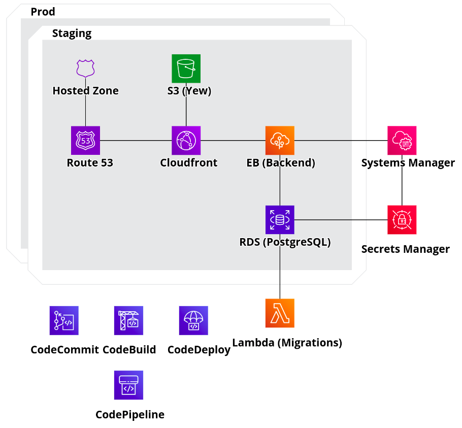

# Rust Full Stack

## Diagram

## Authentication, Authorization

`Auth0` is used for authentication and authorization

## Frontend

* [Yew](https://yew.rs/) for frontend.
* `OpenAPI Generator` for rust API client. 

## Backend

* [Diesel](https://diesel.rs/) (PotsgreSQL)
* `OpenAPI Generator` for Rust server.
* AWS Lambda for migrations (Rust binary with embedded migrations, built with musl) 
* [aws-sdk-rust](https://github.com/awslabs/aws-sdk-rust) for retrieving database credentials from systems manager and secrets manager 

## CI/CD

* `CodeCommit`
* `CodeBuild` (Custom build image stored in Elastic Container Registry)
* `CodeDeploy`
* `CodePipeline`
* Multi-stage environment support

